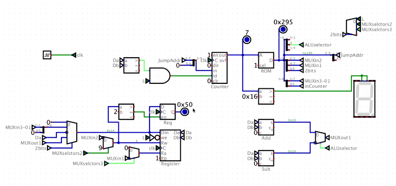

# Custom 10-Bit CPU Architecture for Intelligent EV Battery Management System (BMS)

An application-specific, custom 10-bit processor architecture designed, simulated, and programmed from scratch using the open-source **Digital** logic simulation tool by Helmut Neemann. This project implements a fully functional closed-loop Intelligent Battery Management System (BMS) for an Electric Vehicle (EV), regulating simulated battery charge and discharge cycles entirely at the hardware and register level.

---

## 👤 Author Information
* **Name:** Vahid Hamzeh Garkani
* **Institution:** Sharif University of Technology
* **Department:** Electrical Engineering
* **Student ID:** 402101577

---

## 📱 Live Simulation Demo
Below is a live capture of the custom datapath executing the machine code program sequentially, showing automatic loop transitions between driving (discharging) and plugging in (charging), with live 7-Segment status monitoring:

*(Note: Place your animated screen capture GIF in an `assets/` folder and name it `simulation.gif` to render it here)*

---

## 🛠 Architecture & Instruction Set (ISA)
The CPU employs a customized **10-bit Instruction Set Architecture** with a 2-bit primary Opcode field (`bits 8-9`). The instruction formatting changes dynamically based on the decoded instruction type.

### 1. Instruction Formats
* **ALU Operations (`Opcode = 11`):** `[11][Arithmetic Type (4 bits)][Destination Register (4 bits)]`
  * Implements `ADD` and `SUB` routines.
* **Register Move (`Opcode = 10`):** `[10][Source Register (4 bits)][Destination Register (4 bits)]`
  * Transfers data between registers inside the 16-word Register File.
* **Immediate Load (`Opcode = 01`):** `[01][Immediate Value (8 bits)]`
  * **Hardware Constraint:** Based on the assignment rule (`Student ID Last Digit + 2 = 7 + 2 = 9`), the `IMM` instruction is hardwired to always target **Register 9 (`R9`)** as a scratchpad destination.
* **Conditional Jump (`Opcode = 00`):** `[00][New Target PC Address (8 bits)]`
  * Dictates branch logic (`CND`) based on ALU/Comparator flag states.

---

## 🔄 BMS Control Logic & Algorithm
The microcode program manages a state machine for battery optimization using boundaries defined as follow:
1. **Initialization:** Battery capacity is calibrated to an initial level of **80** (stored dynamically in `R2`). Constant values for discharge rate (**4 units** in `R3`), charge rate (**6 units** in `R4`), lower cutoff boundary (**20 units** in `R5`), and upper cutoff ceiling (**89 units** in `R6`) are pre-loaded via `R9` intermediate operations.
2. **Discharge Loop (Vehicle in Motion):** Every clock cycle, the ALU executes `R2 = R2 - R3`. The hardware continually polls whether `R2 < 20`. While false, it cycles unconditionally. When true, it sets the 7-Segment display to `1` (Charging Indicator Active) and branches to the charging routine.
3. **Charge Loop (Vehicle at Station):** The ALU executes `R2 = R2 + R4`. The comparator monitors whether `R2 > 89`. While false, charging continues. Once the upper bound is surpassed, the 7-segment clears to `0` and the control flow loops back into the discharging state safely.

---

## 📊 Complete ROM Assembly & Machine Code Map

| ROM Addr | Hex Code | Assembly Instruction | Functional Explanation | Binary Representation (10-Bit) |
| :---: | :---: | :--- | :--- | :---: |
| **0x00** | `0150` | `IMM 80` | Load initial battery level 80 into Temp Reg (`R9`) | `0101010000` |
| **0x01** | `0292` | `MOV R9, R2` | Move initial battery level from `R9` to `R2` (Battery) | `1010010010` |
| **0x02** | `0104` | `IMM 4` | Load normal discharge rate 4 into Temp Reg (`R9`) | `0100000100` |
| **0x03** | `0293` | `MOV R9, R3` | Move discharge rate from `R9` to `R3` | `1010010011` |
| **0x04** | `0106` | `IMM 6` | Load charging rate 6 into Temp Reg (`R9`) | `0100000110` |
| **0x05** | `0294` | `MOV R9, R4` | Move charge rate from `R9` to `R4` | `1010010100` |
| **0x06** | `0114` | `IMM 20` | Load lower limit threshold 20 into Temp Reg (`R9`) | `0100010100` |
| **0x07** | `0295` | `MOV R9, R5` | Move lower threshold from `R9` to `R5` | `1010010101` |
| **0x08** | `0159` | `IMM 89` | Load upper safety threshold 89 into Temp Reg (`R9`) | `0101011001` |
| **0x09** | `0296` | `MOV R9, R6` | Move upper threshold from `R9` to `R6` | `1010010110` |
| **0x0A** | `0101` | `IMM 1` | Load logical constant 1 into Temp Reg (`R9`) | `0100000001` |
| **0x0B** | `029E` | `MOV R9, R14` | Move constant 1 from `R9` to `R14` (Status Register) | `1010011110` |
| **0x0C** | `0100` | `IMM 0` | Load logical constant 0 into Temp Reg (`R9`) | `0100000000` |
| **0x0D** | `029F` | `MOV R9, R15` | Move constant 0 from `R9` to `R15` (Status Register) | `1010011111` |
| **0x0E** | `0220` | `MOV R2, R0` | Route Battery (`R2`) to ALU input Port A | `1000100000` |
| **0x0F** | `0231` | `MOV R3, R1` | Route Discharge Rate (`R3`) to ALU input Port B | `1000110001` |
| **0x10** | `0312` | `SUB R2` | Calculate: `R2 = R2 - R3` (Execute ALU Subtraction) | `1100010010` |
| **0x11** | `0250` | `MOV R5, R0` | Move Lower Threshold 20 to Port A for conditional check | `1001010000` |
| **0x12** | `0221` | `MOV R2, R1` | Move current Battery level to Port B for conditional check | `1000100001` |
| **0x13** | `0017` | `CND 0x17` | Branch to Charge Routine (`0x17`) if Battery level < 20 | `0000010111` |
| **0x14** | `02E0` | `MOV R14, R0` | Setup True status flags to force loop redundancy | `1011100000` |
| **0x15** | `02F1` | `MOV R15, R1` | Setup False status flags to force loop redundancy | `1011110001` |
| **0x16** | `000E` | `CND 0x0E` | Unconditional loop back to `0x0E` to continue driving | `0000001110` |
| **0x17** | `0220` | `MOV R2, R0` | Route Battery (`R2`) to ALU input Port A | `1000100000` |
| **0x18** | `0241` | `MOV R4, R1` | Route Charge Rate (`R4`) to ALU input Port B | `1001000001` |
| **0x19** | `0302` | `ADD R2` | Calculate: `R2 = R2 + R4` (Execute ALU Addition) | `1100000010` |
| **0x1A** | `0220` | `MOV R2, R0` | Move current Battery level to Port A for condition evaluation| `1000100000` |
| **0x1B** | `0261` | `MOV R6, R1` | Move Upper Threshold 89 to Port B for condition evaluation| `1001100001` |
| **0x1C** | `000E` | `CND 0x0E` | Branch to Drive Routine (`0x0E`) if Battery level > 89 | `0000001110` |
| **0x1D** | `02E0` | `MOV R14, R0` | Setup status flags for unconditional charge loop state | `1011100000` |
| **0x1E** | `02F1` | `MOV R15, R1` | Setup status flags for unconditional charge loop state | `1011110001` |
| **0x1F** | `0017` | `CND 0x17` | Unconditional loop back to `0x17` to sustain charging | `0000010111` |

---

## 🚀 How to Run the Simulation
1. Download and install [Digital](https://github.com/hneemann/Digital).
2. Clone this repository to your local machine.
3. Open the main circuit design file (`*.dig`) within the Digital environment.
4. Right-click on the embedded **ROM** component, click *Load*, and import the machine code file (`.hex` or copy directly from the instruction map).
5. Press the **Play** button to initialize the simulation. 
6. Turn on the automatic **Clock Generator** or step through manually to observe live automated register state jumps and indicator display status updates.
